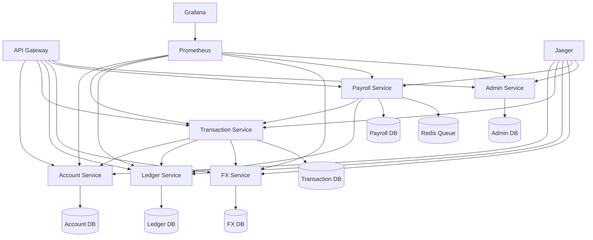

# NovaPay Transaction Backend

## Overview

This repository contains a microservices-based backend for NovaPay with separate services for accounts, transactions, ledger, FX quotes, payroll, and admin. The stack is self-contained in `docker-compose.yml` with Postgres, Redis, Prometheus, Grafana, Jaeger, and an NGINX gateway.



## Idempotency Scenarios

### Scenario A: Same key arrives twice

- **Handling**: Prisma unique constraint on `idempotencyKey` prevents duplicate inserts at database level
- **Result**: Second request returns the original transaction status without side effects

### Scenario B: Three identical requests arrive within 100ms

- **Handling**: Database-level row locking ensures only one succeeds; others get P2002 constraint violation
- **Result**: Exactly one transaction processes; losers retry with same key (safe due to idempotency)

### Scenario C: Server crashes after debit but before credit (Atomicity)

- **Handling**: Transaction service uses synchronous cross-service calls in sequence; recovery endpoint detects incomplete transactions and completes them
- **Result**: Money never vanishes; either fully succeeds or fully reverses

### Scenario D: Idempotency key expires after 24 hours

- **Handling**: Age check on existing transaction; if >24h, reject with clear error forcing new key
- **Result**: Prevents stale key reuse while allowing reasonable retry windows

### Scenario E: Client sends key-abc for $500, then key-abc for $800

- **Handling**: SHA-256 hash of payload stored with transaction; mismatch detected and rejected
- **Result**: Payload integrity enforced; prevents parameter tampering

## Double-Entry Ledger Invariant

Every transaction creates balanced entries where `Sum(Debits) = Sum(Credits)`. This invariant is enforced before database commit. Violation triggers immediate alert (Prometheus metric `ledger_invariant_violations_total > 0`).

## FX Quote Strategy

- **Locking**: Quotes issued with 60s TTL at transfer initiation time
- **Single-use**: Atomic `status: UNUSED -> USED` prevents reuse
- **Failure handling**: Provider unavailability returns clear error; never applies cached/stale rates
- **Recording**: Exact locked rate stored in every cross-currency ledger entry

## Payroll Resumability

Uses BullMQ with `concurrency: 1` per employer. Each employee disbursement gets unique idempotency key (`payroll-{jobId}-{employeeId}`). Failed jobs retry; already-processed employees are safely skipped.

## Audit Hash Chain

Each ledger entry includes an `auditHash` computed as `SHA-256(previousHash + entryData)`. Chain starts with "genesis" hash. Tampered records break the chain, detectable via `/ledger/audit/verify` endpoint. In practice, this ensures financial records cannot be altered without detection.

## Tradeoffs Made

- **Microservices isolation**: No shared DBs (good for scaling) but requires cross-service calls (latency)
- **Idempotency via DB constraints**: Simple but requires careful payload hashing
- **Envelope encryption**: Secure but adds complexity; chose AES-256-GCM for field-level protection
- **BullMQ concurrency=1**: Prevents race conditions but limits throughput for large payrolls
- **No shared caching**: Each service manages its own (simplicity over performance)

## Production Readiness Additions

- **API Gateway**: Rate limiting, authentication, request transformation
- **Service Mesh**: Istio/Linkerd for traffic management, circuit breakers
- **Database**: Connection pooling, read replicas, backup/restore automation
- **Security**: OAuth2/JWT, API key rotation, secrets management (Vault)
- **Monitoring**: Alerting rules, log aggregation (ELK), distributed tracing dashboards
- **CI/CD**: Blue-green deployments, canary releases, automated rollback
- **Compliance**: PCI DSS for payments, SOC 2 audit trails, GDPR data handling
- **Performance**: Database indexing, caching layers (Redis), CDN for static assets
- **Reliability**: Multi-region deployment, chaos engineering, disaster recovery

## Setup

1. Copy environment variables:

```bash
cp .env.example .env
```

2. Start the full stack:

```bash
docker-compose up --build
```

3. Access external services:

- Gateway API: `http://localhost`
- Grafana: `http://localhost:3000` (admin/admin)
- Prometheus: `http://localhost:9090`
- Jaeger: `http://localhost:16686`

## Service URLs

- API gateway: `http://localhost`
- Account service: `http://localhost:3001`
- Transaction service: `http://localhost:3002`
- Ledger service: `http://localhost:3003`
- FX service: `http://localhost:3004`
- Payroll service: `http://localhost:3005`
- Admin service: `http://localhost:3006`

## API Endpoints

### Account Service

#### Create account

POST `http://localhost/accounts`

Request body:

```json
{
  "userId": "user-123",
  "currencyCode": "USD",
  "initialBalance": 1000,
  "ownerName": "Alice Example"
}
```

Response body:

```json
{
  "id": "<account-id>",
  "currencyCode": "USD",
  "balance": 1000,
  "createdAt": "2026-04-06T...",
  "requestId": "..."
}
```

#### Get balance

GET `http://localhost/accounts/:id/balance`

Response body:

```json
{
  "balance": 1000,
  "currency": "USD"
}
```

#### Adjust balance

POST `http://localhost/accounts/:id/adjust`

Request body:

```json
{
  "amount": -100,
  "adjustmentId": "tx-123-debit"
}
```

Response body:

```json
{
  "balance": 900,
  "requestId": "..."
}
```

#### Retrieve encrypted secret data

GET `http://localhost/accounts/:id/secret?owner=true`

Response body:

```json
{
  "ownerName": "Alice Example",
  "requestId": "..."
}
```

### FX Service

#### Create locked quote

POST `http://localhost/fx/quote`

Request body:

```json
{
  "fromCurrency": "USD",
  "toCurrency": "EUR"
}
```

Response body:

```json
{
  "id": "<quote-id>",
  "fromCurrency": "USD",
  "toCurrency": "EUR",
  "rate": 0.92,
  "expiresAt": "2026-04-06T...",
  "status": "UNUSED"
}
```

#### Check quote validity

GET `http://localhost/fx/quote/:id`

Response body:

```json
{
  "id": "<quote-id>",
  "fromCurrency": "USD",
  "toCurrency": "EUR",
  "rate": 0.92,
  "expiresAt": "...",
  "status": "UNUSED",
  "timeRemainingMs": 25000
}
```

#### Use quote (single-use)

POST `http://localhost/fx/quote/:id/use`

Response body:

```json
{
  "id": "<quote-id>",
  "status": "USED",
  "rate": 0.92
}
```

### Transaction Service

#### International transfer

POST `http://localhost/transactions/transfers/international`

Request body:

```json
{
  "idempotencyKey": "transfer-abc123",
  "senderId": "sender-wallet-id",
  "receiverId": "receiver-wallet-id",
  "amount": 100,
  "fromCurrency": "USD",
  "toCurrency": "EUR",
  "fxQuoteId": "<quote-id>"
}
```

Response body:

```json
{
  "id": "<transaction-id>",
  "status": "COMPLETED",
  "requestId": "..."
}
```

#### Recover incomplete transfer

POST `http://localhost/transactions/transfers/recover/:id`

Response body:

```json
{
  "id": "<transaction-id>",
  "status": "COMPLETED",
  "requestId": "..."
}
```

### Payroll Service

#### Submit bulk payroll

POST `http://localhost/payroll/bulk`

Request body:

```json
{
  "employerId": "employer-123",
  "currency": "USD",
  "payments": [
    { "employeeId": "emp-1", "amount": 1500 },
    { "employeeId": "emp-2", "amount": 1400 }
  ]
}
```

Response body:

```json
{
  "message": "Payroll queued successfully",
  "jobId": "<job-id>"
}
```

### Ledger Service (internal)

#### Create ledger entries

POST `http://localhost:3003/ledger/entries`

Request body:

```json
{
  "transactionId": "<transaction-id>",
  "entries": [
    {
      "accountId": "sender-wallet-id",
      "debitAmount": 100,
      "creditAmount": 0,
      "currency": "USD",
      "fxQuoteId": "<quote-id>",
      "fxRate": 0.92
    },
    {
      "accountId": "receiver-wallet-id",
      "debitAmount": 0,
      "creditAmount": 92,
      "currency": "EUR",
      "fxQuoteId": "<quote-id>",
      "fxRate": 0.92
    }
  ]
}
```

#### Retrieve ledger transaction

GET `http://localhost:3003/ledger/transaction/:transactionId`

Response body:

```json
{
  "entries": [ ... ]
}
```

## Idempotency Handling

1. Scenario A: duplicate key arrives twice.
   - The Transaction service stores `idempotencyKey` under a unique DB constraint.
   - The second request is detected on insert failure and returns the existing transaction result. No second debit occurs.

2. Scenario B: three identical requests in 100ms.
   - The first request succeeds and commits.
   - The database unique constraint rejects the subsequent concurrent inserts with `P2002`.
   - The code catches that conflict and returns the stored transaction rather than reprocessing.

3. Scenario C: sender debited, crash before recipient credited.
   - The transaction remains `PENDING` in `transaction-service`.
   - Manual recovery via `/transactions/transfers/recover/:id` reads ledger entries and replays the missing account adjustments.
   - This ensures the transfer can be completed without duplicate ledger entries.

4. Scenario D: idempotency key older than 24 hours.
   - The service checks the existing transaction age.
   - If `ageMs > 24h`, it returns `400 Idempotency key expired after 24h. Use a new key.`

5. Scenario E: same key with payload mismatch.
   - The service stores an SHA-256 `payloadHash`.
   - On duplicate key reuse, it compares the new payload hash with the stored one.
   - If different, it rejects with `400 Idempotency key exists but payload changed`.

## Double-Entry Invariant

- The Ledger service requires at least two entries per transaction.
- It verifies `totalDebit === totalCredit` within a tiny tolerance (`0.0001`) before writing.
- If the invariant fails, `ledger_invariant_violations_total` increments and the request is rejected.
- Ledger entries are written transactionally via Prisma.

## FX Quote Strategy

- `POST /fx/quote` issues a locked quote with `expiresAt = now + 60s`.
- `GET /fx/quote/:id` verifies freshness and returns remaining time.
- `POST /fx/quote/:id/use` atomically transitions `UNUSED -> USED` only if the quote still exists and is not expired.
- The transaction service rejects expired or already-used quotes with a clear error.
- The exact locked rate is recorded on ledger entries via `fxQuoteId` and `fxRate`.

## Payroll Resumability

- Payroll bulk jobs are queued in BullMQ.
- Each employee transfer uses a unique idempotency key: `payroll-${jobId}-${employeeId}`.
- If the worker retries or the job restarts, duplicate sub-transfers are ignored by the transaction service.
- The payroll job updates `processedCount` so progress is visible and resumable.

## Field-Level Encryption

- Account owner names are encrypted with AES-256-GCM.
- A randomly generated data key encrypts the plaintext, and that data key is envelope-encrypted with the global `MASTER_KEY`.
- Raw sensitive values are never stored in plaintext in the database.
- Decryption is only allowed through `/accounts/:id/secret?owner=true`.

## Observability

- Prometheus metrics endpoints are exposed by each service at `/metrics`.
- `docker-compose.yml` includes Prometheus, Grafana, and Jaeger.
- OpenTelemetry instrumentation is implemented with Jaeger tracing for end-to-end observability across all services.

## CI/CD

- `.github/workflows/ci.yml` detects changed service directories and runs build steps only for changed services.
- The pipeline builds Docker images for each changed service.
- There is not yet coverage for unit tests because service packages currently do not include test suites.

## Recommended Production Improvements

- Add explicit unit and integration tests for each service.
- Add real secret management (Vault/KMS) for `MASTER_KEY` instead of `.env`.
- Implement full OpenTelemetry tracing in the app code and instrument request flow across services.
- Add an API gateway layer for authentication, rate limiting, and centralized routing.
- Add an audit hash chain or append-only tamper-detection ledger for stronger record integrity.
- Implement health and readiness probes for container orchestration.
- Harden database migrations, backup, and failover tooling.

## Postman Collection

A Postman collection is provided at `postman_collection.json` with the main account, FX, transaction, payroll, and recovery flows.
